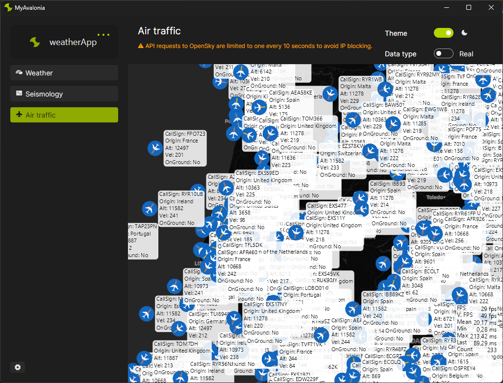
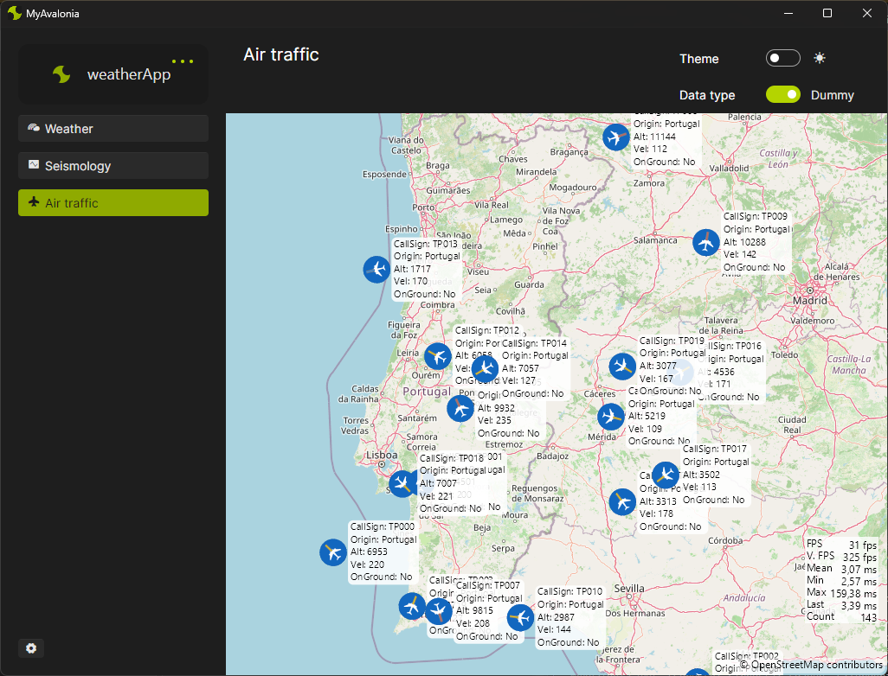
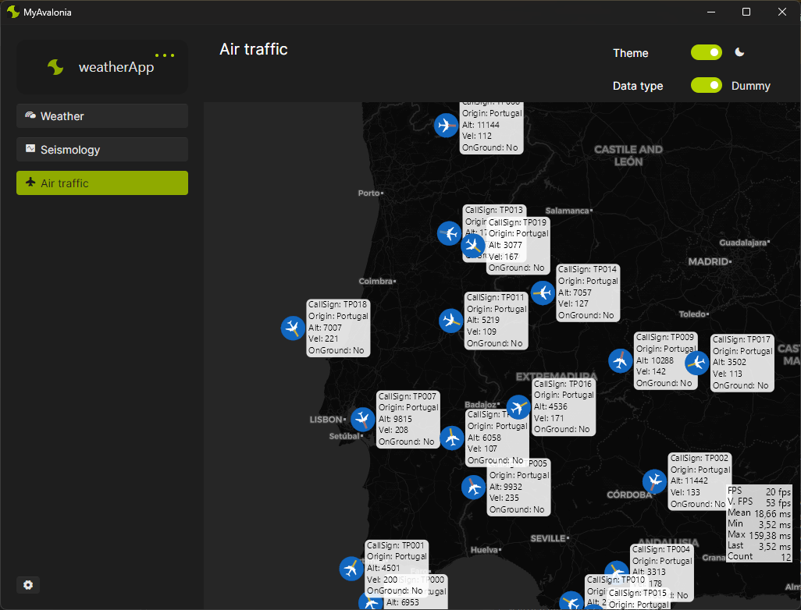

# Avalonia-Playground
Project created for learning Avalonia
* Uses IPMA public API
    - Generic HttpClient included
    - Full working API CLient for IPMA data gathering
* Work in progress

https://github.com/user-attachments/assets/8cd1f348-36ec-47e0-a9db-0ce91badc928

https://github.com/user-attachments/assets/072676d2-6f82-44b8-8937-5a5f1913a80c

https://github.com/user-attachments/assets/7c19e87b-f19f-4b34-be80-9c9ec726b354

https://github.com/user-attachments/assets/9358b404-9c12-41af-93a4-12766cb33603

https://github.com/user-attachments/assets/242f9357-5e1b-407b-aaac-23e9da8a7850

